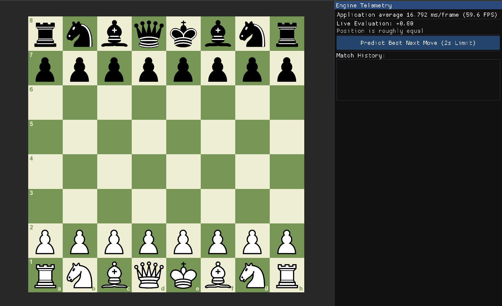
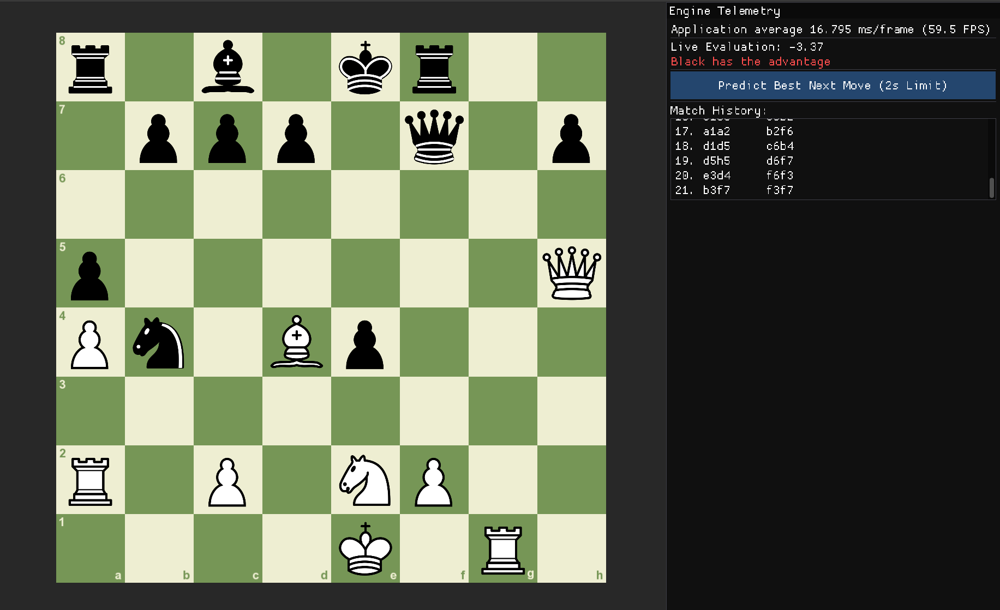
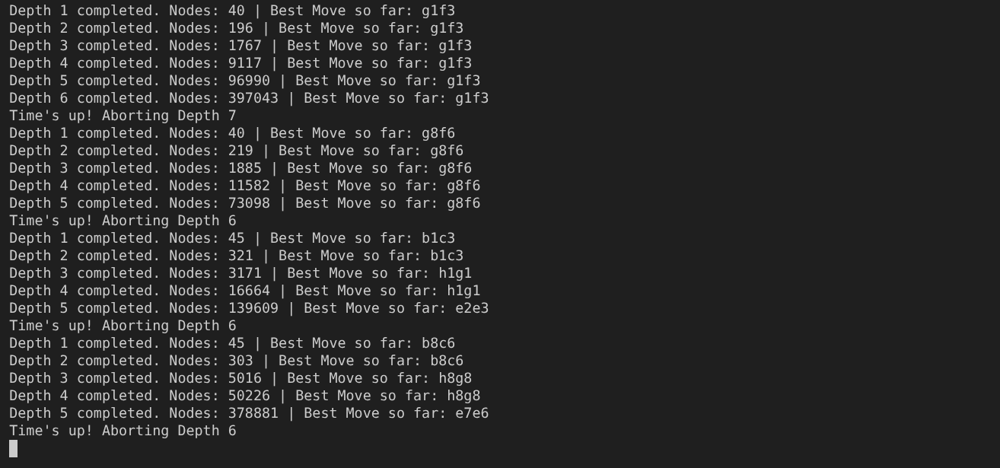

<div align="center">

# Chess Next Move Predictor

**Modern C++ Chess Engine with an Interactive SFML GUI**

Featuring Alpha-Beta Pruning, Iterative Deepening, Quiescence Search, and Transposition Tables for real-time move prediction.

[](https://en.cppreference.com/w/cpp/17)
[](https://www.sfml-dev.org/)
[](https://github.com/ocornut/imgui)
[](https://github.com/Disservin/chess-library)

</div>

---

## Overview

Chess Next Move Predictor is a **desktop chess engine and visualization tool** built in **Modern C++17**. The project combines an interactive SFML chessboard with a handcrafted search engine that evaluates positions and predicts the strongest legal move within a configurable time limit.

The engine implements several classical techniques used in traditional chess engines, including **Iterative Deepening**, **Alpha-Beta Pruning**, **Quiescence Search**, **Move Ordering**, and **Transposition Tables**. Together, these algorithms allow the engine to search significantly deeper than a naïve minimax implementation while remaining responsive during gameplay.

To keep the project modular, the application is divided into three independent layers:

- **GUI** – Handles rendering, drag-and-drop interaction, and displays engine information.
- **Core** – Maintains the board state and validates legal moves using `chess.hpp`.
- **Engine** – Evaluates positions and searches for the strongest continuation.

The result is a modular chess engine that demonstrates the core algorithms behind classical computer chess while providing an interactive environment for experimentation and analysis.

---
## Application Preview
<p align="center">
  
</p>

<p align="center">
  
</p>

---
## Features

- **Interactive Chessboard** — Drag-and-drop interface built with **SFML 3** for intuitive gameplay.
- **Classical Chess Engine** — Predicts the strongest legal move using **Minimax** enhanced with **Alpha-Beta Pruning**.
- **Iterative Deepening Search** — Continuously searches deeper until the configured time limit expires, always returning the best move from the deepest completed iteration.
- **Quiescence Search** — Extends tactical positions beyond the normal search depth to reduce the horizon effect.
- **Transposition Table** — Uses **Zobrist hashing** to cache previously evaluated positions and eliminate redundant calculations.
- **Move Ordering** — Prioritizes promotions and high-value captures using an **MVV-LVA** heuristic to improve alpha-beta efficiency.
- **Live Position Evaluation** — Displays the engine's evaluation of the current position directly within the GUI.
- **Move History** — Records every move played during the game for easy review.
- **Modular Architecture** — Clean separation between the **GUI**, **Board Management**, and **Search Engine** for maintainability and extensibility.
- **Live Search Diagnostics** — Displays completed search depth, explored nodes, the current best move, and time-limit events during engine analysis.

---

## Architecture

The project follows a layered architecture where the graphical interface, board representation, and search engine operate independently. The GUI is responsible only for rendering and user interaction, while all chess logic is delegated to the core board wrapper and search engine.

```text
                         User Input
                   (Drag & Drop Pieces)
                             │
                             ▼
                  +----------------------+
                  |      SFML GUI        |
                  |  Board + ImGui Panel |
                  +----------+-----------+
                             │
                             ▼
                  +----------------------+
                  |     core::Board      |
                  |  Board State Wrapper |
                  +----------+-----------+
                             │
                             ▼
                  +----------------------+
                  |     chess.hpp        |
                  | Legal Move Generator |
                  +----------+-----------+
                             │
                             ▼
                  +----------------------+
                  |    Search Engine     |
                  |  Alpha-Beta Minimax  |
                  +----------+-----------+
                             │
          +------------------+------------------+
          │                                     │
          ▼                                     ▼
  Move Ordering                    Transposition Table
      (MVV-LVA)                     (Zobrist Hashing)
          │                                     │
          +------------------+------------------+
                             │
                             ▼
                    Quiescence Search
                             │
                             ▼
                   Position Evaluation
        (Material and simple positional evaluation.)
                             │
                             ▼
              Best Move & Live Evaluation
```

### Design Philosophy

The application is intentionally divided into three independent modules:

| Module | Responsibility |
|--------|----------------|
| **GUI** | Renders the chessboard, processes mouse events, displays engine telemetry, and visualizes the current position. |
| **Core** | Maintains the board state and validates legal moves through `chess.hpp`. |
| **Engine** | Evaluates positions and searches the game tree to predict the strongest continuation. |

This separation keeps the rendering layer completely independent of the chess engine. The GUI never performs move generation or evaluation, while the engine has no knowledge of rendering or user interaction, making each subsystem easier to maintain and extend.

---

## Core Components

| Component | Technology | Purpose |
|-----------|------------|---------|
| **Board** | `chess.hpp` | Maintains the game state, generates legal moves, validates move legality, and exports board positions as FEN strings. |
| **Search Engine** | Modern C++ | Implements Iterative Deepening, Alpha-Beta Pruning, Quiescence Search, Move Ordering, and Transposition Tables to predict the strongest move. |
| **Evaluation** | Custom Heuristics | Scores positions using material balance, positional bonuses, and basic king safety heuristics. |
| **Board Renderer** | SFML 3 | Renders the chessboard, pieces, coordinates, and translates mouse input into chess moves. |
| **Telemetry Panel** | Dear ImGui | Displays engine evaluation, move history, performance statistics, and prediction controls in real time. |

---

## Project Structure

```text
chess-next-move-predictor/
├── assets/
│   ├── pieces.png
│   └── font.ttf
├── include/
│   ├── core/
│   │   └── board.hpp
│   ├── engine/
│   │   ├── evaluation.hpp
│   │   └── search.hpp
│   └── gui/
│   │   ├── application.hpp
│   │   └── board_renderer.hpp
├── src/
│   ├── core/
│   │   └── board.cpp
│   ├── engine/
│   │   ├── evaluation.cpp
│   │   └── search.cpp
│   ├── gui/
│   │   ├── application.cpp
│   │   └── board_renderer.cpp
│   └── main.cpp
├── CMakeLists.txt
└── README.md
```

---

## Getting Started

### Prerequisites

Before building the project, ensure the following dependencies are installed:

- **C++17** compatible compiler (`g++` or `clang++`)
- **CMake 3.15** or newer
- **SFML 3**
- **OpenGL**
- **Dear ImGui**
- **imgui-sfml**
- **chess.hpp**

---


### Build

```bash
# Clone the repository
git clone https://github.com/<your-username>/chess-next-move-predictor.git

cd chess-next-move-predictor

# Configure the project and compile
mkdir build
cd build
cmake ..
make
```
---

### Run

```bash
./ChessNextMovePredictor
```
After launching the application:

- Drag and drop pieces to play legal moves.
- Watch the live engine evaluation update after every move.
- Click **Predict Best Next Move** to let the engine search for the strongest continuation.
- Review the complete move history from the telemetry panel.

---
## Engine Diagnostics

During each search, the engine outputs real-time diagnostics to the console, providing insight into the search process and making it easier to analyze performance and debug the engine.

The diagnostic output includes:

- Search depth completed
- Number of nodes explored
- Current best move after each iteration
- Time-limit notifications

Example:

<p align="center">
  
</p>

These logs demonstrate how Iterative Deepening progressively refines the engine's prediction while respecting the configured search time limit.

---

## Current Limitations

- Evaluation majorly relies on center and material advantage.
- No opening book or endgame tablebases.
- Single-threaded search.
- Less king safety precautions other than castling.
---

## Possible Future Improvements

- King safety evaluation
- Killer Move & History heuristics
- Multi-threaded search
- Opening book & Endgame tablebases

---